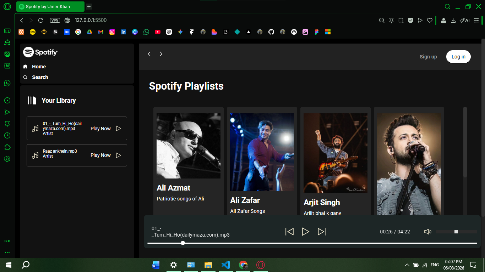

# Spotify Web Player Clone

A responsive Spotify-inspired music streaming web application built using pure HTML5, CSS3, and Vanilla JavaScript. Developed to strengthen core JavaScript concepts including asynchronous programming, DOM manipulation, dynamic rendering, and audio playback.

## Features

- Dynamic Album Loading: Automatically loads albums and songs from the local music library using the Fetch API.
- Music Player: Play, pause, next, previous, seek bar, and volume controls with real-time playback updates.
- Playlist Rendering: Generates song lists dynamically from album metadata.
- Responsive Design: Optimized layout for desktop, tablet, and mobile devices.
- Interactive UI: Spotify-inspired sidebar, album cards, playlists, and hover effects.
- Asynchronous Data Fetching: Uses `async/await` and the Fetch API to retrieve album information and song data.

## Tech Stack

### HTML5
- Semantic page structure
- HTML Audio element

### CSS3
- Flexbox
- CSS Grid
- Media Queries
- Custom animations

### JavaScript (ES6+)
- DOM Manipulation
- Event Handling
- Async/Await
- Fetch API
- Audio API
- Dynamic UI Rendering

## Visual Representation

 

  

